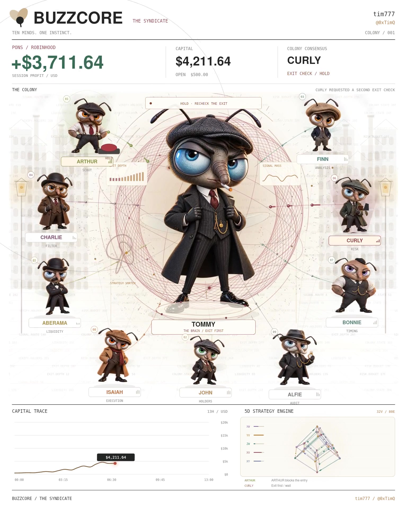

# BUZZCORE

**Ten minds. One instinct.**



A cinematic renderer for the ORBIT desk operated as @tim777. Ten cartoon flies play out a single 13-hour paper-trading session on $PONS in 31.9 seconds of animation. Nine seats work the pipeline; the tenth holds a veto over their consensus. The whole run is executed inside one deterministic script and one final video render.

The visible show is a Peaky Blinders-styled colony brain. The invisible one is the doctrine every seat is bound by: **exit first. if you cannot get out clean, you do not get in.**

## The colony

Eleven characters. TOMMY is the boss and the doctrine. Every friend owns one part of the pipeline; every part has a chip below the character and a lane in the operations ledger.

| # | NAME     | ROLE      | WHAT THEY DO IN THE SESSION                            |
|---|----------|-----------|--------------------------------------------------------|
| 01 | ARTHUR  | SCOUT     | Detects the candidate, assembles the signal packet     |
| 02 | JOHN    | HOLDERS   | Checks the holder snapshot, maps concentration         |
| 03 | FINN    | ANALYSIS  | Confirms momentum, forwards evidence to CHARLIE        |
| 04 | CHARLIE | FILTER    | Removes paid noise, isolates the organic signal        |
| 05 | ABERAMA | LIQUIDITY | Models exit depth, reviews slippage, rechecks the exit |
| 06 | CURLY   | RISK      | Applies the risk limit, holds the exit-first veto      |
| 07 | BONNIE  | TIMING    | Tags the entry window, refuses the wrong retest        |
| 08 | ISAIAH  | EXECUTION | Submits and fills the order                            |
| 09 | ALFIE   | AUDIT     | Seals the fill, records the audit trail                |
| —  | TOMMY   | THE BRAIN | Owns the doctrine; consensus is a request, not a right |

CURLY is the seat every other seat is measured against. The visible frame keeps rendering while the operator wants to override him; the render keeps rendering after he refuses.

## Scene

Native **1536×1920, 60 fps, 31.9 s**. One continuous canvas.

The scene composes in a fixed order per frame — a paper background with dot grid and phrase drift, a nine-fly ring around a central halo, a boss on the pedestal, packet trails that pulse along the ring, wings and legs animated per character, a curling smoke plume above his cigarette, a capital trace filling in from the left, and a 5D strategy engine rendered live in the bottom right. During the risk-hold beat the halo swells to red and CURLY's chip becomes the consensus line.

Characters were generated with the built-in image generator (one pass per asset) and stored as PNGs with alpha. Everything else — motion, layout, HUD, timing, capital curve, event log — is authored code in `render.cjs`. There is no timeline editor, no compositor, no external video track. One script emits the finished MP4.

## Run

Requires **Node.js 20+** and **FFmpeg on PATH**.

```
npm install
npm run render      # full render, writes renders/preview.mp4
npm run stills      # writes review PNGs to work/ instead of encoding video
```

A finished MP4 is checked in at `renders/preview.mp4` — you do not need to render to view.

## Output

`renders/preview.mp4` — 1536×1920, H.264 High, yuv420p, ~4 Mbps, ~19 MB. AAC audio (96 kbps) bundled. Plays inline on every major browser and posts natively on every social feed. Re-encode from the `work/` frames at a lower CRF for a higher-fidelity master.

## Scope

This is an authored motion-design project, not a live trading application.

- $PONS and the target profit were supplied by the project owner as animation inputs.
- Intermediate balances, event timings, and the operations ledger are animation data, not a transaction export.
- No wallet is connected. No private key is loaded. No live order is placed. The 5D strategy engine is a Lissajous-style visualization, not a genome trainer.
- The doctrine the video illustrates — that a network's meaning is measured by what it is allowed to refuse, not what it is allowed to do — is a design claim, not a benchmark.

## Soundtrack

User-provided **AVANGARD (Slowed + Reverb)**, excerpt 32.27–64.17 s, matched to the previous music level and attenuated during the risk-hold beat. Third-party audio is included for this private render and excluded by `.gitignore`; obtain the needed rights or replace the file before public source distribution.

## Assets and fonts

- `assets/cortex.png` — TOMMY, cropped from the character-sheet pass, alpha preserved.
- `assets/syndicate.png` — 3×3 sheet of the nine friends, sampled by the renderer per position.
- `fonts/NimbusSans-Regular.otf`, `fonts/NimbusSans-Bold.otf` — headings and character chips (URW, GPL).
- `fonts/DejaVuSansMono.ttf` — HUD numerics, timestamps, event log (DejaVu, public license).
- License notices for both font families are shipped in `fonts/LICENSE-*`.

To move this off Linux, `@napi-rs/canvas` picks up bundled TTF/OTF via `GlobalFonts.registerFromPath` — no platform paths to edit.

## Project map

```
buzzcore/
├── README.md
├── package.json           # "buzzcore-syndicate" · @napi-rs/canvas
├── render.cjs             # ~200-line deterministic renderer
├── .gitignore             # excludes node_modules/, work/, soundtrack.m4a
├── assets/
│   ├── cortex.png         # TOMMY portrait
│   ├── syndicate.png      # 9-friend sheet
│   └── soundtrack.m4a     # gitignored
├── fonts/
│   ├── NimbusSans-Regular.otf
│   ├── NimbusSans-Bold.otf
│   ├── DejaVuSansMono.ttf
│   └── LICENSE-*
└── renders/
    └── preview.mp4        # finished 31.9 s render
```

## License

MIT. See `LICENSE`.
